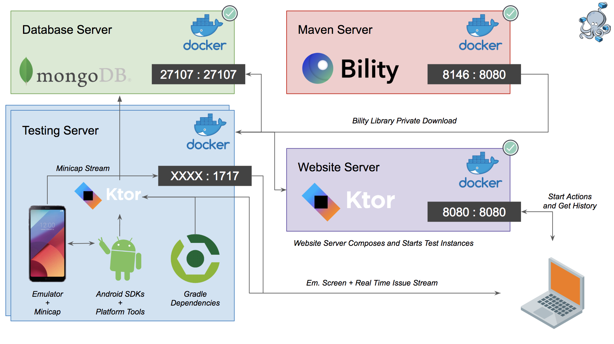
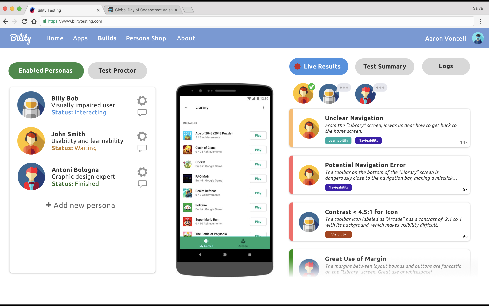

# Bility

[Trello Board](https://trello.com/b/cwWM50Jf) - [Drive](https://drive.google.com/drive/folders/11ScSgQSKj3s64hVFgaWVQBWeqB_U9mU-?usp=sharing) - [Local Maven](http://localhost:8146/artifactory/webapp/home.html?5)

----------------------------------------------------------------

<div align="center">
  <br />
</div>


The goal of Bility to provide a cheap, automated, and easy-to-use solution to user testing. Imagine your app development cycle: create a feature / UX, have CI test your code with unit tests and front end tests, and then schedule / setup a user study to evaluate results. After running the user test, if you find issues, you need to go back, address these issues, and spend more time and money conducting more user tests. *Why not move this into the CI process?*

Bility has a collection of **personas**, or essentially AIs that can understand user interfaces, report issues, and make actions on the user interface. The business phases for the project are as follows:

1) Infrastructure for testing Android for basic accessibility and usability issues.
2) Infrastructure for incorporating into existing CI flows
3) Use Selenium or equivalent for web, ios, etc... apps
4) Further personas (aligned with next paragraph) + persona store
5) Testing on prototypes and mockups

The advanced tech goals / bread and butter of this project is as follows:

1) Rule-based system for detecting basic UI issues (for instance, accessibility is basically a checklist of items)
2) Universal Design Language (UDL) so we can treat Android, iOS, and Web apps in the same way
3) OCR and vision data for dealing with Sketch files (i.e. user study before building the apps)
4) Advanced human-behavior modeling (i.e. simulate eye tracking, learning what 'good design' means, etc)

Make sure to check out the `Theory/` folder for technical background.

## Infrastructure Overview

In terms of technologies, everything is pretty much a mix of Kotlin, Gradle, and Docker. Click the links below to see the setup for each component.

- [MongoDB](#mongo-setup) - A Docker container hosting our MongoDB (current on port 27017)
- [Maven](#maven-setup) - We use a local Maven / Artifactory server to host all dependencies used in Gradle
- [Bility Core](#core-bility-library) - A Kotlin library with core types and utilities, used across all components. Uploaded as a jar to the Maven repo
- [Android Library](#bility-android-library) - An Android library which is dynamically injected into projects, which has code to actually interact with the Android device during testing.
- [Android Server](#android-server) - This is a Docker container + [ktor.io](http://ktor.io) server that has all Android dependencies and a webserver used to control the container.
- [Web Server](#web-server) - This is a Docker container + [ktor.io](http://ktor.io) server that acts as the main entrypoint for the project

See the [bottom of this document for]() 1) screenshots and architecture figures

## Setup Instructions

The project is setup as a monorepo, managed through the Gradle build system. Their is a top-level `build.gradle` file, 
as well as build files for each sub-project. Open the project within IntelliJ IDEA, and if you open the Gradle view / window,
you should see **AndroidServer**, **BilityCore**, **BilityBuildSystem**, **BilityWebServer**, and **InternalBilityTester**. If these are not shown, make sure to add each `build.gradle` from each sub-project by click the '+' button.

*Note, there is a `docker-compose.yml` file for setting up all of our services, but it does not work properly yet, so don't use this yet*

### Mongo Setup

The central database for the Bility system is MongoDB, which holds build configurations, user information, build history, etc. The database server is a vanilla MongoDB Docker container, which can be built and run using the commands below:

```
docker pull mongo
docker run --name mongo-dev -d -p 27017:27017 mongo
```

You can now start a shell within this container, or view the logs, with these following commands:

```
docker exec -it mongo-dev bash
docker logs mongo-dev
```

See more here: https://hub.docker.com/_/mongo/

If more configurations or files need to be added to this, use the `db/` folder.

### Maven Setup

In order to keep the Bility libraries private, we host everything as a Maven artifict locally, which can be accessed internally. The Maven repo is hosted using the Artificatory dependency management system. **In the future, we may abandon this approach and just use a monorepo, import paths**. This can be started with the commands below:

```
docker pull mattgruter/artifactory
docker run --name maven-local -d -p 8146:8080 mattgruter/artifactory
```

You can now view the logs, with the following command:

```
docker logs maven-local
```

You can also view the Artifactory homepage at http://localhost:8146/ (this will be useful for checking that your artifact is successfully loaded afterwards)

More information can be found here: https://hub.docker.com/r/mattgruter/artifactory/

### Core Bility Library

The core Bility library is a Kotlin library providing common functionality and types used across the webserver, Android tester, etc... It can be build and pushed to the Artifactory server through the following command:

```
cd BilityCore
./gradlew clean build shadowJar uploadShadow
cd ..
```

If you visit [the Maven repo](http://localhost:8146/artifactory/webapp/home.html?1) and do to `Artifacts` > `libs-release-local` > `org` > `vontech` > `core`, you should see the Maven, POM, and Jar information. The core library can now be added to and gradle project through the following steps:

1) (if not done already) Add the Artifactory repo to your project through the steps located [here](#adding-the-maven-server-to-your-gradle-file)
2) Add the following dependency to your project:

```
compile(group: 'org.vontech', name: 'core', version: '0.0.1')
```

### Bility Android Library

The Bility Android Library is responsible for controlling a device during testing, obtaining View and device information, sending this information to the Android server, and receiving action instructions from the Android server. This project (located in `InternalBilityTester/`) includes two Gradle modules:

- `app` - An example app used to quickly test the `bilitytester` functionality (if the Android server is running)
- `bilitytester` - Library with actual logic for controlling and testing an application

**NOTE: The instructions after this next code block are not stable and does not work entirely, please simply add the library as a dependency using the following line:**

```
androidTestImplementation project(path: ':bilitytester')
```

We now want to push the Bility libary to our local maven server, so that we can access it within any tested Android apps. Do this with the following commands:

```
cd InternalBilityTester/
./gradlew :bilitytester:clean :bilitytester:build :bilitytester:uploadArchives
cd ..
```

There should now be an .aar file at http://localhost:8146/artifactory/webapp/browserepo.html within the `libs-release-local` dropdown. Add the project with the Gradle compile information given on the site.


### Android Server

**Note: this needs some modification: AndroidContainer/ has the ktor server for starting up Android emulators and setting up test projects. The Dockerfile and startup scripts from android-test/ need to be moved to this container**

The Android Server (located in `AndroidContainer/`) is a project that has the following components:

- A ktor.io server which can handle Android testing, and acts as communication between an emulator, the DB, and the front-end site for the user
- (After moving the Dockerfile to the right place) A Dockerfile for an Android build server, complete with
    - Android SDKs 25-27
    - Android NDK
    - Build Tools
    - Emulators
    - Minicap (used to stream the device screen over TCP to the front-end)

**WARNING - This container takes up like 5GB of space due to the platform tools / SDKs from Android**

The idea is that we spin up multiple Android containers to handle builds.

Run the main class (`Application.kt`) to start the server.

### Web Server

The web server is the main entry point for the user, and controls the mapping of users to Android containers. The goal of this is to handle most front-end components of the website, handle requests to start builds, and upon seeing these requests, figuring out which Android container to run the test on. This is a ktor.io gradle project, found in `BilityWebServer`.

The webserver is written in Kotlin using Gradle and the Ktor library. Build and start the Docker container for this webserver with the following commands (remove the `it` to run in the background):

```
cd BilityWebServer/
./gradlew build
docker build -t bility-k-webserver .
docker run --name bility-k-webserver -d -p 8080:8080 --rm bility-k-webserver
```

## Other Setup Instructions

### Adding the Maven Server to your Gradle file

In order to add the Maven Server connection to your Gradle project, make sure that the following is inserted into the top-level / project-level gradle file:

```
buildscript {
    repositories {
        maven {
            credentials {
                username 'admin'
                password 'password'
            }
            url 'http://localhost:8146/artifactory/libs-release-local'
        }
    }
}

allprojects {
    repositories {
        maven {
            credentials {
                username 'admin'
                password 'password'
            }
            url 'http://localhost:8146/artifactory/libs-release-local'
        }
    }
}
```

## Deprecated Code / Currently Unused Code

There is some code that has been deprecated, exists as a reference, or has not yet been developed. This includes the following:

- `android/` - A Dockerfile with many more Android dependencies that are not really needed at this point. I used this as a reference for building the Dockerfile for our own Android build server.
- `android-test/` - An old Android server, but does have the correct Dockerfile.
- `dependencies/` - Old dependencies used / built at the beginning of this project.
- `ocr/` - A module for running OCR on Android screens, yet to be used or built out.

The `build`, `demo`, and `job` scripts are old and can be used for reference.

*Additionally, you may create an OCR container simply through:

```
docker pull tesseractshadow/tesseract4re
```

## Figures and Screenshots

<div align="center">
  <br />
</div>

<div align="center">
  <br />
</div>

## Comparison to Other Frameworks and Tools

<table class="tg">
  <tr>
    <td class="tg-0lax">Test on Non-debug APK</td>
    <td class="tg-baqh"></td>
    <td class="tg-baqh">&#9989;</td>
    <td class="tg-baqh"></td>
    <td class="tg-baqh"></td>
  </tr>
  <tr>
    <td class="tg-0lax">Issue Simplification</td>
    <td class="tg-baqh">&#9989;</td>
    <td class="tg-baqh"></td>
    <td class="tg-baqh"></td>
    <td class="tg-baqh"></td>
  </tr>
  <tr>
    <th class="tg-kiyi">Feature</th>
    <th class="tg-88nc">Bility</th>
    <th class="tg-amwm">Google Accessibility Scanner</th>
    <th class="tg-amwm">Espresso</th>
    <th class="tg-amwm">Lint</th>
  </tr>
  <tr>
    <td class="tg-xldj">Automated</td>
    <td class="tg-uys7">&#9989;</td>
    <td class="tg-baqh"></td>
    <td class="tg-baqh">&#9989;</td>
    <td class="tg-baqh">&#9989;</td>
  </tr>
  <tr>
    <td class="tg-xldj">Static Code Checking</td>
    <td class="tg-uys7">&#9989;</td>
    <td class="tg-baqh"></td>
    <td class="tg-baqh"></td>
    <td class="tg-baqh">&#9989;</td>
  </tr>
  <tr>
    <td class="tg-xldj">Runtime Static Checking</td>
    <td class="tg-uys7">&#9989;</td>
    <td class="tg-baqh">&#9989;</td>
    <td class="tg-baqh">&#9989;</td>
    <td class="tg-baqh"></td>
  </tr>
  <tr>
    <td class="tg-xldj">Low Contrast Detection</td>
    <td class="tg-uys7">&#9989;</td>
    <td class="tg-baqh">&#9989;</td>
    <td class="tg-baqh">&#9989;</td>
    <td class="tg-baqh"></td>
  </tr>
  <tr>
    <td class="tg-0lax">Screen Reader Label Detection</td>
    <td class="tg-baqh">&#9989;</td>
    <td class="tg-baqh">&#9989;</td>
    <td class="tg-baqh">&#9989;</td>
    <td class="tg-baqh"></td>
  </tr>
  <tr>
    <td class="tg-0lax">Keyboard Trap Detection</td>
    <td class="tg-baqh">&#9989;</td>
    <td class="tg-baqh"></td>
    <td class="tg-baqh"></td>
    <td class="tg-baqh"></td>
  </tr>
  <tr>
    <td class="tg-0lax">Multi-platform Extendable</td>
    <td class="tg-baqh">&#9989;</td>
    <td class="tg-baqh"></td>
    <td class="tg-baqh"></td>
    <td class="tg-baqh"></td>
  </tr>
</table>
