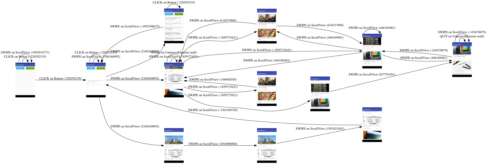
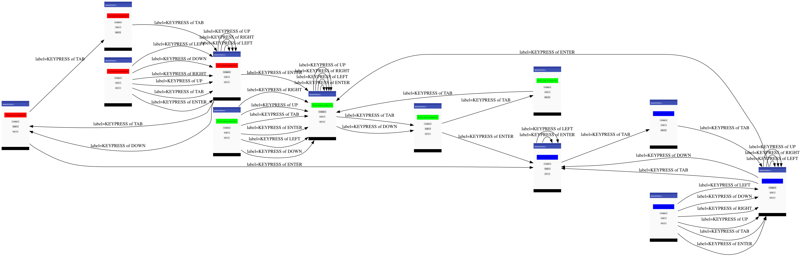
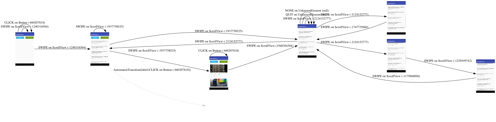
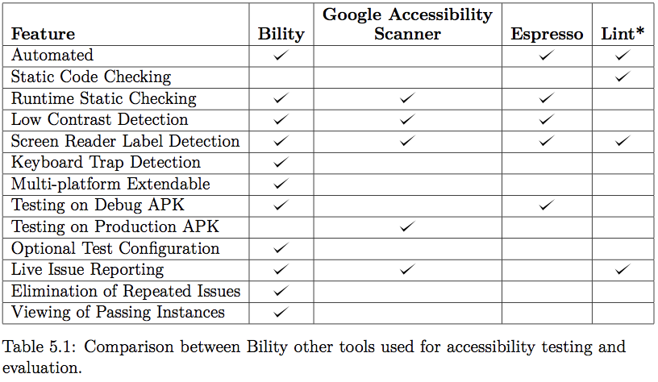
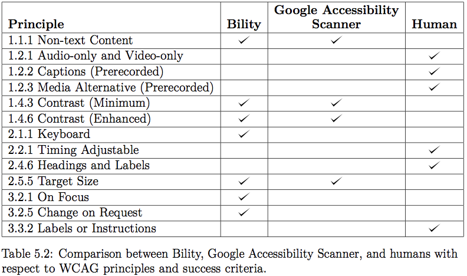

<div align="center">
  <br />
</div>

----------------------------------------------------------------

<a href="https://www.buymeacoffee.com/SYwZPjK4F" target="_blank"></a>

**Warning: This library is in an alpha state, and is not very stable... I am looking for others to help in feature development, testing, etc...**

Bility is a framework for automatically scraping and assessing the accessibility of mobile applications. Unlike tools such as Google Accessibility Scanner that require manual navigation and track static issues (such as contrast and small touch target sizes), Bility automatically explores the application, finding static issues as well as dynamic issues (such as keyboard traps, unexpected changes in context, etc...). A desktop or web app displays both a live recording of the test and a succinct report of all issues found. To see a demo video of the alpha version, click the image below or visit the link <a href="https://youtu.be/Y5AeZpNnp8U">here</a>.

<div align="center">
  <a href="https://youtu.be/Y5AeZpNnp8U">
    <br />
  </a>
</div>

Check out the [thesis paper](https://github.com/vontell/Bility/blob/master/Thesis.pdf) or conference paper (coming soon) to learn more about the theory and evaluation behind the project. 

*Created at the Massachusetts Institute of Technology in association with CSAIL/IPRI/DIG under Lalana Kagal.*

# Usage

## Start the Testing Framework

To start using the Bility test framework, run the following command within the root directory of this project:

```
./bility-start.sh
```

This script will do the following:

1. Download any outside dependencies
2. Start the Android Emulator if not already started
3. Start Minicap, the service that casts the screen for live results
4. Start and display the Bility Electron app
5. Start the testing server

In order for this to run properly, you must define the following environment variables within a file `.bility` within your home directory (e.g. `~/.bility`):

```
ANDROID_SDK=/Users/vontell/Library/Android/sdk
ADB=/Users/vontell/Library/Android/sdk/platform-tools
EM=/Users/vontell/Library/Android/sdk/tools/emulator
NDK=/Users/vontell/Library/Android/sdk/ndk-bundle

EM_TO_USE=Nexus_5X_API_26_x86
```

For an in-depth view on all the services running to support this framework, take a look at `bility-start.sh`, which provides comments on each service.

## Attach a BilityTest to an Application

Once the test server is running in the background, a test file can be added to your application. First, add the following dependencies to your app-level `build.gradle`:

```
android {

    ...

    // If you get dependency version errors, include this 
    // block of code with appropriate versions
    configurations.all {
        resolutionStrategy.force 'com.android.support:support-annotations:21.0.3'
        resolutionStrategy.force 'com.android.support:appcompat-v7:21.0.3'
    }

}

dependencies {

    ...

    // Make sure to include the bilitytester module within 
    // the settings.gradle file of your project
    androidTestCompile project(path: ':bilitytester')

}
```

Next, create a test file within your Android Instrumented Tests directory:

**BilityTest.java**
```Java
package com.mycompany.myapp;

import android.support.test.runner.AndroidJUnit4;

import org.junit.Before;
import org.junit.Test;
import org.junit.runner.RunWith;
import org.vontech.bilitytester.BilityTestConfig;
import org.vontech.bilitytester.BilityTester;

import static android.support.test.InstrumentationRegistry.getInstrumentation;

@RunWith(AndroidJUnit4.class)
public class BilityTest {

    private BilityTestConfig config;

    private final static String url = "http://10.0.2.2:8080";

    @Before
    public void configureAppSpec() {

        config = new BilityTestConfig();
        config.setPackageName("com.mycompany.myapp");
        config.setMaxActions(400);

    }

    @Test
    public void beginBilityTest() {
        new BilityTester(url, getInstrumentation(), config)
                .startupApp()
                .loop();
    }

}
```

Finally, run this class as a unit test, while the services and frontend are running. You will see the result live once you click 'START BILITY TEST' in the frontend!

# How it Works

In a nutshell, Bility works by building a "best-guess" state machine representing the behavior of the application. Each time an action is taken by the **persona** (essentially an AI representing a user), a new edge and state is added to a graph, where the state is a **hash of the user interface after the action was taken** (this hash and state machine formulation can be seen in detail starting on page 29 of `Thesis.pdf`). Below are a few examples of what these state machines look like for some apps.

<div align="center">
  <br />
</div>

<div align="center">
  <br />
</div>

<div align="center">
  <br />
</div>

Once this state machine has been created, Bility can run accessibility tests on both static issues (issues within a single screen, such as poor contrast and missing screen reader labels) as well as dynamic issues (issues as the user interacts with the application, such as keyboard traps and unexpected changes in context). The state machine is also used to help the persona decide with action to take next.

The goal is that this data structure will permit developers to build further tests and better personas. Below we can see the current capabilities of Bility as compared to other tools such as the Google Accessibility Scanner.

<div align="center">
  <br />
</div>

<div align="center">
  <br />
</div>

# Next Steps

Contribute! The issues page has all the information needed to begin working on new features and bug fixes.