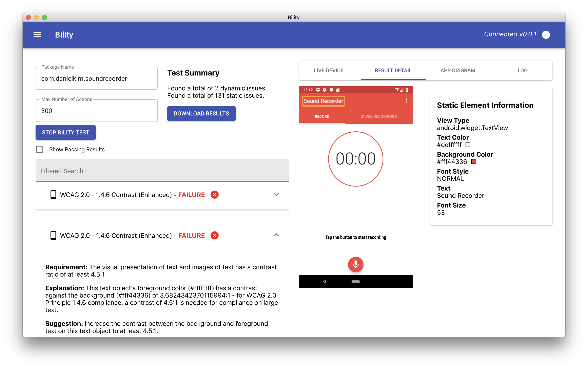

<div align="center">
  <br />
</div>

----------------------------------------------------------------

[Trello Board](https://trello.com/b/cwWM50Jf) - [Drive](https://drive.google.com/drive/folders/11ScSgQSKj3s64hVFgaWVQBWeqB_U9mU-?usp=sharing) - [Local Maven](http://localhost:8146/artifactory/webapp/home.html?5)

<a href="https://www.buymeacoffee.com/SYwZPjK4F" target="_blank"></a>

Bility is a framework for automatically scraping and assessing the accessibility of mobile applications. Unlike tools such as Google Accessibility Scanner that require manual navigation and track static issues (such as contrast and small touch target sizes), Bility automatically explores the application, finding static issues as well as dynamic issues (such as keyboard traps, unexpected changes in context, etc...). A desktop or web app displays both a live recording of the test and a succinct report of all issues found.

<div align="center">
  <br />
</div>

Check of the [thesis paper](https://github.com/vontell/Bility/blob/master/Thesis.pdf) or conference paper (coming soon) to learn more about the theory and evaluation behind the project. 

# Usage

## Start the Testing Framework

To start using the Bility test framework, run the following command within the root directory of this project:

```
./bility-start.sh
```

This script will do the following:

1. Download any outside dependencies
2. Start the Android Emulator if not already started
3. Start Minicap, the service that casts the screen for live results
4. Start and display the Bility Electron app
5. Start the testing server

In order for this to run properly, you must define the following environment variables within a file `.bility` within your home directory (e.g. `~/.bility`):

```
ANDROID_SDK=/Users/vontell/Library/Android/sdk
ADB=/Users/vontell/Library/Android/sdk/platform-tools
EM=/Users/vontell/Library/Android/sdk/tools/emulator
NDK=/Users/vontell/Library/Android/sdk/ndk-bundle

EM_TO_USE=Nexus_5X_API_26_x86
```

For an in-depth view on all the services running to support this framework, take a look at `bility-start.sh`, which provides comments on each service.

## Attach a BilityTest to an Application

Once the test server is running in the background, a test file can be added to your application. First, add the following dependencies to your app-level `build.gradle`:

```
coming soon!
```

Next, create a test file within your Android Instrumented Tests directory:

**BilityTest.java**
```Java
package com.mycompany.myapp;

import android.support.test.runner.AndroidJUnit4;

import org.junit.Before;
import org.junit.Test;
import org.junit.runner.RunWith;
import org.vontech.bilitytester.BilityTestConfig;
import org.vontech.bilitytester.BilityTester;

import static android.support.test.InstrumentationRegistry.getInstrumentation;

@RunWith(AndroidJUnit4.class)
public class BilityTest {

    private BilityTestConfig config;

    private final static String url = "http://10.0.2.2:8080";

    @Before
    public void configureAppSpec() {

        config = new BilityTestConfig();
        config.setPackageName("com.mycompany.myapp");
        config.setMaxActions(400);

    }

    @Test
    public void beginBilityTest() {
        new BilityTester(url, getInstrumentation(), config)
                .startupApp()
                .loop();
    }

}
```